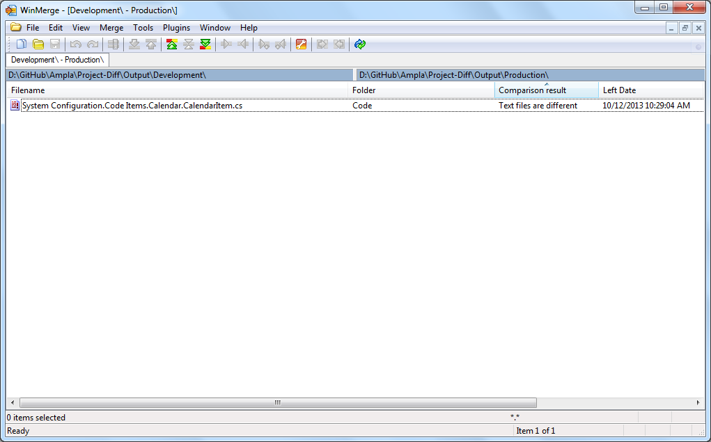
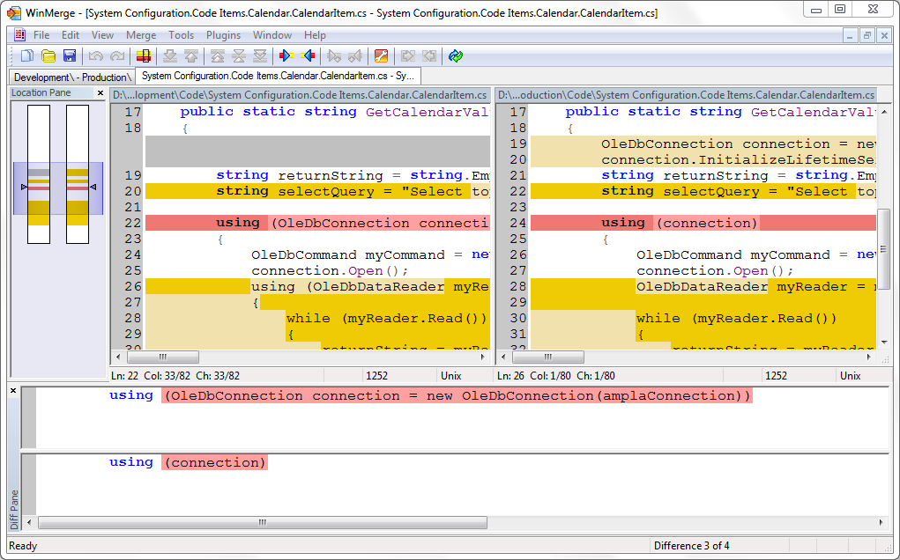

Project-Diff
============

Compare two Ampla projects by extracting key components.  

Often when projects migrating from Development to Production it can be very difficult to understand what is different.

There are a number of good diff tools such as [http://winmerge.org/](http://winmerge.org/), but the challenge is the standard Project Export and Authstore files are too complex.

What is does.
===
Project-Diff will run a set of scripts over an AmplaProject and Authstore file to extract the configuration into a standard text format that can be easily compared.  

When the project is analysed, a set of templates are used to match particular items and output the configuration in either an xml or text format.  A JSON like format can be useful for comparing the structure of the project.

File Structure
===
* **Development** directory
  * *Where the Development AmplaProject.xml file is placed*
* **Production** directory
  * *Where the Production AmplaProject.xml file is placed*
* **Output** directory
  * **Development** directory 
    * *```Development``` output files are placed here*
  * **Production** directory
    * *```Production``` output files are placed here*
* **Working** directory
  * *Where the intermediate files are placed*
* **src** directory
  * *Source files*
* **lib** directory
  * *libraries that are used*

Output templates
===

* Code items
* Data Repository
* List of all items by type
* Reporting Points
  *  Downtime
  *  Production
  *  Quality
  *  Metrics
  *  Maintenance
  *  Planning
* Classes
  * Equipment 
  * Material
  * Personnel


Example output
===

**List of items of each type**

```
Type : Citect.Ampla.General.Server.Classification
Count: 6 items
System Configuration.Lookup Lists.Classifications.No Scheduled Production - NSP
System Configuration.Lookup Lists.Classifications.Operating Delay - OD
System Configuration.Lookup Lists.Classifications.Operating Standby - OS
System Configuration.Lookup Lists.Classifications.Scheduled Loss - SL
System Configuration.Lookup Lists.Classifications.Unscheduled Loss Failure - ULF
System Configuration.Lookup Lists.Classifications.Unscheduled Loss Other - ULO
```

**JSON like format**

```JSON
{ "Item" :
    {
    "fullName" : "Schneider Coal.Yellow Rock Mine.Fixed Plant.CHPP Red.Consumables", 
    "id" : "19a09b93-58c4-493f-a982-7eed15e11d1e", 
    "name" : "Consumables", 
    "type" : "Citect.Ampla.Production.Server.ProductionReportingPoint",
    "Property" :
        {
        "DisplayOrder" : "50008"
        }
    "Item" :
        [
        { "Item" :
            {
            "fullName" : "Schneider Coal.Yellow Rock Mine.Fixed Plant.CHPP Red.Consumables.Conditions", 
            "id" : "4b00cc08-d973-41d4-abcb-0c1fd8acbd31", 
            "name" : "Conditions", 
            "type" : "Citect.Ampla.General.Server.ConditionsFolder",
            "Property" :
                {
                "DisplayOrder" : "50008"
                }
            }
        }
        { "Item" :
            {
            "fullName" : "Schneider Coal.Yellow Rock Mine.Fixed Plant.CHPP Red.Consumables.Fields", 
            "id" : "25e7cf8c-e6af-4213-b337-457dcc289ebf", 
            "name" : "Fields", 
            "type" : "Citect.Ampla.Production.Server.ProductionFieldsFolder",
            "Property" :
                {
                "DisplayOrder" : "50000"
		},
            "Item" :
                [
                { "Item" :
                    {
                    "fullName" : "Schneider Coal.Yellow Rock Mine.Fixed Plant.CHPP Red.Consumables.Fields.Block ID", 
                    "id" : "fd0a9725-a3bd-4f01-862e-a5c48c51bfd6", 
                    "name" : "Block ID", 
                    "type" : "Citect.Ampla.Production.Server.ProductionFieldDefinition",
                    "Property" :
                        {
                        "AllowedValuesLookupList" : "System Configuration.Lookup Lists.Block IDs",
			"AllowedValuesType" : "LookupList",
                        "DataType" : "String",
                        "DisplayOrder" : "50220",
                        "FieldType" : "ID",
                        "Filterable" : "True",
                        "HistoricalFieldExpression" : 
                            { 
							"HistoricalExpressionConfig" :     
								{
								"ExpressionConfig" :     
									{
									"format" : "#ItemReference0#.Samples[time]", 
									"compileAction" : "Compile", 
									"filterValues" : "False", 
									"text" : "Project.[System Configuration].[Data Sources].OsiPiHDA.NORTH.[HCM_CHPPNTH_BLOCK].Samples[time]"
									},
								"ItemLinkCollection" :     
								{
									"ItemLink" :     
									{
											"relativePath" : "Parent.Parent.Parent.Parent.Parent.Parent.Parent.System Configuration.Data Sources.OsiPiHDA.NORTH.HCM_CHPPNTH_BLOCK", 
											"absolutePath" : "System Configuration.Data Sources.OsiPiHDA.NORTH.HCM_CHPPNTH_BLOCK", 
											"targetID" : "045aa05d-a9b8-4e47-a75b-2c17c3f38ae0", 
											"resolveMode" : "Smart", 
									}
								}
							},
							"DependencyCollection" :     
								{
								"Dependency" :     
									{
									"dependencyType" : "TriggerOperand",
									"ItemPropertyLink" :     
										{
										"propertyName" : "Samples", 
										"ItemLink" :     
											{
												"relativePath" : "Parent.Parent.Parent.Parent.Parent.Parent.Parent.System Configuration.Data Sources.OsiPiHDA.NORTH.HCM_CHPPNTH_BLOCK", 
												"absolutePath" : "System Configuration.Data Sources.OsiPiHDA.NORTH.HCM_CHPPNTH_BLOCK", 
												"targetID" : "045aa05d-a9b8-4e47-a75b-2c17c3f38ae0", 
												"resolveMode" : "Smart"
											}
										}
									}
								}
							},
			"PasteInGrid" : "True",
            		"ShowInDetails" : : "True",
          	}
          ]
      }
  }
```

Screenshots
===
The screenshots show the ***WinMerge*** output when there is a difference in one of the code items. 





  
